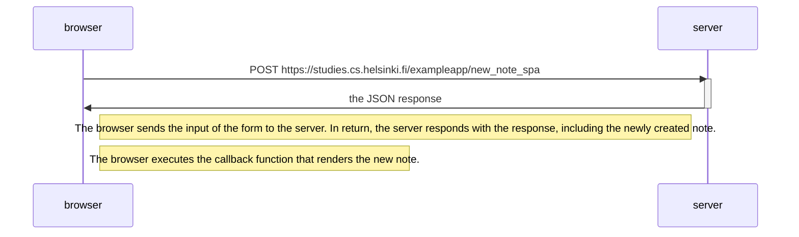

# SPA New Note Sequence Diagram

```mermaid
sequenceDiagram
	participant browser
	participant server
	
	browser->>server: POST https://studies.cs.helsinki.fi/exampleapp/new_note_spa
	activate server
	server->>browser: the JSON response
	deactivate server

    Note right of browser: The browser sends the input of the form to the server. In return, the server responds with the response, including the newly created note.
    Note right of browser: The browser executes the callback function that renders the new note.
```