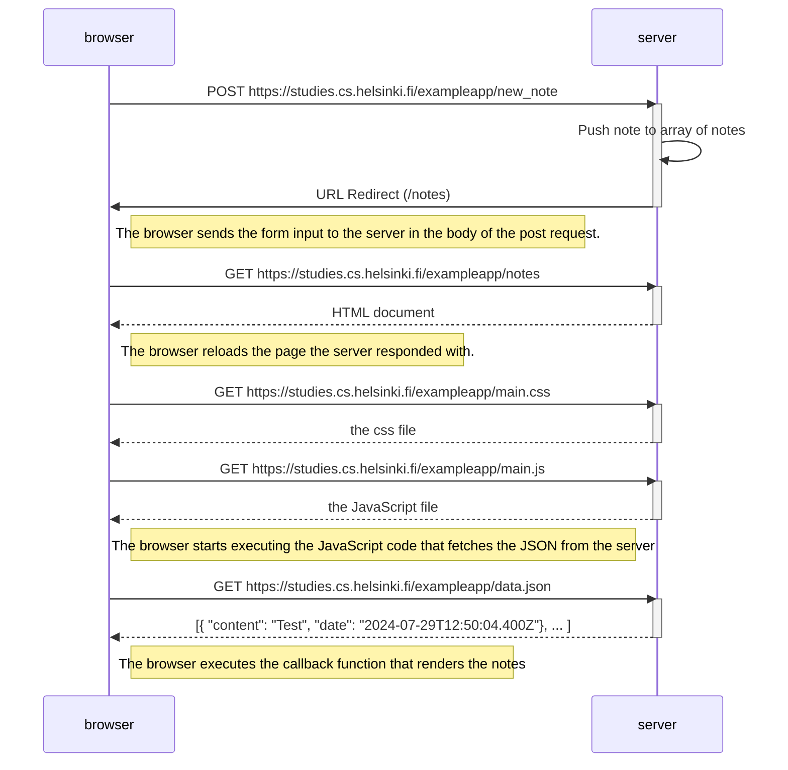

# New Note Sequence Diagram

```mermaid
sequenceDiagram
	participant browser
	participant server
	
	browser->>server: POST https://studies.cs.helsinki.fi/exampleapp/new_note
	activate server
	server->>server:  Push note to array of notes
	server->>browser: URL Redirect (/notes)
	deactivate server
	
	Note right of browser: The browser sends the form input to the server in the body of the post request.
	
    browser->>server: GET https://studies.cs.helsinki.fi/exampleapp/notes
    activate server
    server-->>browser: HTML document
    deactivate server
    
    Note right of browser: The browser reloads the page the server responded with.

    browser->>server: GET https://studies.cs.helsinki.fi/exampleapp/main.css
    activate server
    server-->>browser: the css file
    deactivate server

    browser->>server: GET https://studies.cs.helsinki.fi/exampleapp/main.js
    activate server
    server-->>browser: the JavaScript file
    deactivate server

    Note right of browser: The browser starts executing the JavaScript code that fetches the JSON from the server

    browser->>server: GET https://studies.cs.helsinki.fi/exampleapp/data.json
    activate server
    server-->>browser: [{ "content": "Test", "date": "2024-07-29T12:50:04.400Z"}, ... ]
    deactivate server

    Note right of browser: The browser executes the callback function that renders the notes	
```